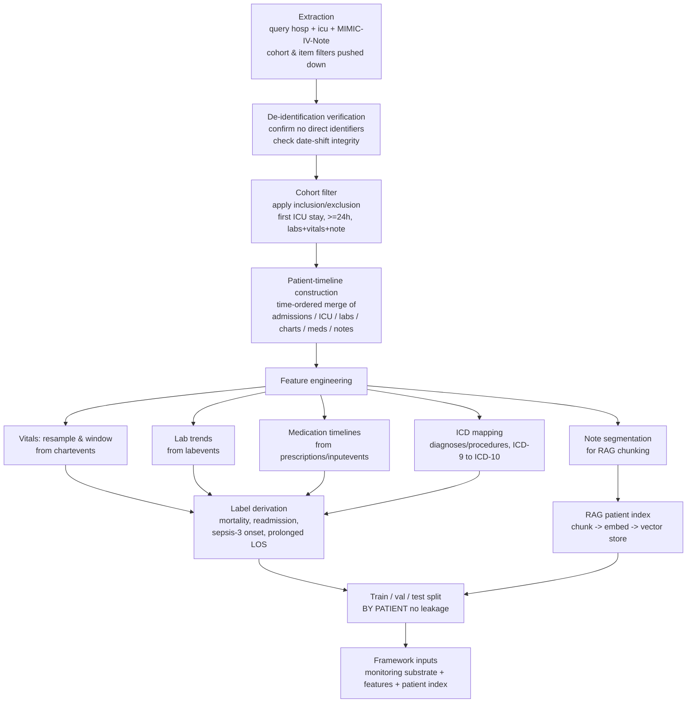

# Preprocessing Pipeline

This document describes how raw MIMIC-IV tables are transformed into the inputs the proposed
framework consumes: a time-ordered patient timeline that serves as the monitoring substrate,
a set of engineered features for the risk and diagnosis agents, and a per-patient document
index for Retrieval-Augmented Generation (RAG). The pipeline is specified here as a plan; it
is executed only inside the secured, credentialed environment described in `README.md`, and no
stage of it writes data into this repository. It reads the tables catalogued in
`Data_Dictionary.md` and produces the cohort defined in `Cohort_Definition.md`.

The guiding idea is that a patient's care is fundamentally a sequence of timestamped events,
labs drawn, vitals charted, drugs given, notes written, and that most of the framework's
capabilities follow naturally once those events are merged into a single ordered timeline per
patient. The monitoring function reads that timeline forward in time; the risk and diagnosis
functions read windows of it; and the RAG module indexes the narrative slices of it. Building
the timeline correctly, with honest handling of MIMIC-IV's date-shifting and its separate note
module, is therefore the central task of preprocessing.

## Pipeline overview

## Stage 1: Extraction

Extraction pulls the required slice of the `hosp`, `icu`, and MIMIC-IV-Note modules from the
credentialed database. As explained in `Data_Dictionary.md`, the cohort and item filters are
pushed down into the extraction queries rather than applied after a full load, so that the very
large tables, `chartevents` above all, are never materialized in their entirety. The output of
this stage is a set of cohort-scoped, item-scoped extracts held only in the secured environment.
Because MIMIC-IV-Note is a separate release, extraction of the `discharge` and `radiology`
tables is a distinct step that will fail silently, leaving an empty note set, if the note module
has not been downloaded and joined; the pipeline checks for non-empty note coverage and stops
rather than proceeding to build a cohort that cannot satisfy the note-availability criterion.

## Stage 2: De-identification verification

Although MIMIC-IV ships de-identified, the pipeline does not take that on faith. This stage
confirms that no direct identifiers are present in the extracts and that the per-patient date
shifting behaves as documented: intervals within a patient must be internally consistent (for
example, `outtime` after `intime`, note `charttime` within the admission window) even though
absolute dates are fictitious. The check also scans note text for residual identifiers before
any note is passed downstream to embedding, since narrative fields are where de-identification
is hardest and where a leak would be most consequential. Failing this stage halts the pipeline;
it is a precondition for everything that follows.

## Stage 3: Cohort filter

The inclusion and exclusion criteria from `Cohort_Definition.md` are applied here in the order
specified there: the first ICU stay per patient is selected before the length-of-stay and
data-availability thresholds, so that a patient is never silently promoted to a later stay. The
result is the resolved cohort, a concrete list of `subject_id` and `stay_id` values, which is
itself data and is kept out of the repository. Everything downstream operates only on this set.

## Stage 4: Patient-timeline construction

For each patient in the cohort, the events from every source table are merged into one
chronologically ordered sequence keyed to the ICU stay. Admission and ICU boundaries provide the
frame; laboratory results, charted vitals, medication starts and stops, fluid inputs and
outputs, and note timestamps are then interleaved by their event times. Because MIMIC-IV date
shifts are applied consistently per patient, relative ordering and inter-event intervals are
preserved, which is exactly what the timeline needs; absolute calendar dates are irrelevant to
the framework and are not used. All event times are additionally expressed relative to the
stay's `intime` (for example, "hour 6 of the stay"), which is the coordinate the monitoring and
windowing logic actually operates on.

This merged, time-ordered structure is the **monitoring substrate**. The Monitoring Agent reads
it as a forward-moving stream: at any simulated point in the stay it can see everything charted
up to that time and nothing after, which is what allows early-detection behavior (such as
flagging deterioration before a sepsis onset time) to be evaluated honestly rather than with
hindsight. Constructing the timeline once, per patient, and then replaying it is both more
faithful to bedside reality and cheaper than re-querying source tables for every agent step.

## Stage 5: Feature engineering

Five families of features are derived from the timeline. Each is computed strictly from
information available up to the relevant point in the stay so that no future information leaks
into a feature used for prediction.

**Vitals resampling and windowing.** The irregular, high-frequency vital signs from
`chartevents` are resampled onto a regular time grid within fixed windows measured from
`intime`. Within each window the pipeline summarizes each vital (for example, minimum, maximum,
mean, and last value) and derives simple trend descriptors. This converts a noisy, unevenly
sampled stream into the compact, fixed-shape representation the Monitoring and Risk agents
consume, and it is the concrete reason `chartevents` must be windowed rather than used raw.

**Lab trends.** Laboratory values from `labevents` are aligned to the same time frame and
summarized as levels and changes over the stay, capturing both the current value and its
direction. These feed diagnosis reasoning and the SOFA components used in sepsis labeling.

**Medication timelines.** Prescriptions and infusions (`prescriptions`, `inputevents`) are
turned into interval-based timelines of active medications, with free-text drug names
normalized to a consistent vocabulary. Antibiotic administration intervals also feed the
suspected-infection window used in the Sepsis-3 label.

**ICD mapping.** Diagnosis and procedure codes (`diagnoses_icd`, `procedures_icd`) span both
ICD-9 and ICD-10 in MIMIC-IV, so a version-aware mapping harmonizes them to a single coding
scheme before they are used for comorbidity and case-mix features. Without this step the same
clinical concept would appear under two incompatible codes.

**Note segmentation for RAG.** The `discharge` and `radiology` texts are segmented into
sections and then into retrieval-sized chunks, preserving enough surrounding context that a
retrieved chunk is interpretable on its own. Segmentation respects document structure (for
example, splitting a discharge summary at its section headers) so that chunks correspond to
coherent clinical units rather than arbitrary character spans.

## Stage 6: Label derivation

The four supervised targets from `Cohort_Definition.md`, in-hospital mortality, ICU readmission,
Sepsis-3 onset, and prolonged length of stay, are computed here from the structured tables and
attached to each patient's timeline. Label logic that must look beyond the index stay, notably
readmission, is confined to this stage and never feeds back into the feature families of Stage
5, which keeps prediction features free of outcome leakage.

## Stage 7: RAG patient index

The note chunks from Stage 5 are embedded and written to a vector store, producing a
**per-patient document index**. Chunk records retain their `subject_id`, `hadm_id`, source
document type, and relative timestamp as metadata, so retrieval can be scoped to a single
patient and, when needed, to notes available up to a given point in the stay. This index is what
the RAG module searches during reasoning: when the Diagnosis or Treatment agent needs narrative
evidence for a patient, it retrieves the most relevant chunks from that patient's index rather
than from the entire corpus, which keeps retrieved evidence patient-specific and temporally
honest. The vector store, like every other artifact here, lives in the secured environment and
is excluded from version control, including the embeddings themselves, since they are derived
from de-identified but still non-redistributable note text.

## Stage 8: Train/validation/test split

The cohort is partitioned into training, validation, and test sets **at the patient level**: all
records, timeline, features, labels, and note chunks, for a given `subject_id` fall entirely
within one partition. Splitting by patient rather than by record or by stay is essential because
the same patient's data appearing in more than one partition would let a model or agent see, in
training, information about a patient it is later tested on. Because the cohort uses one ICU stay
per patient, a patient-level split is also a stay-level split, which keeps the boundary clean.
The resolved split assignments are recorded so results are reproducible, and, as with all data
products of this pipeline, they are kept out of the repository.

## Outputs

The pipeline yields three coordinated products, all held only in the secured environment: the
per-patient monitoring timeline, the engineered feature sets with their derived labels, and the
RAG patient index. Together these are the concrete inputs to the proposed framework's data,
memory, reasoning, and agent layers. Nothing in this stage list writes to version control; the
repository holds only the code and configuration that regenerate these products from the
credentialed source.
