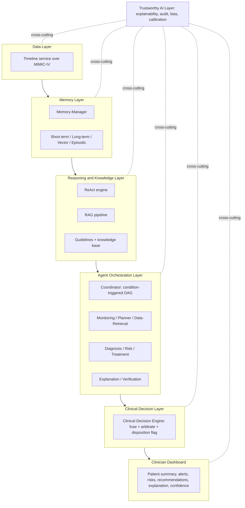
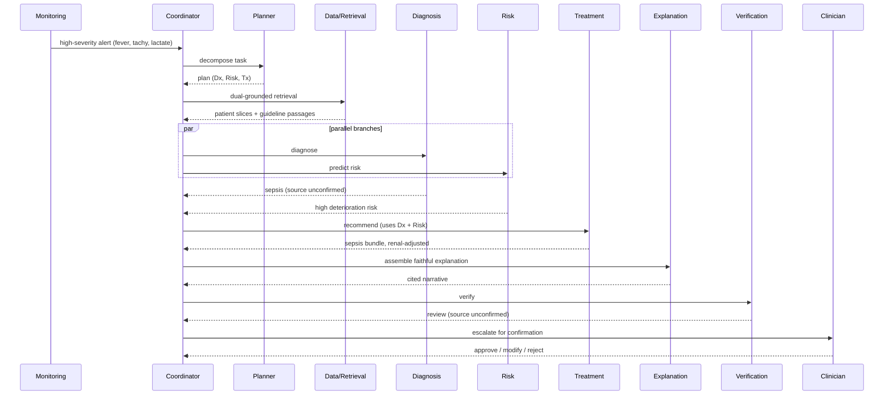
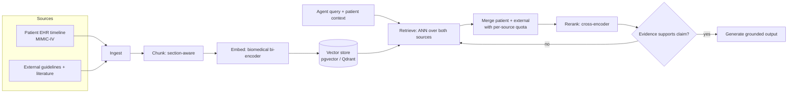
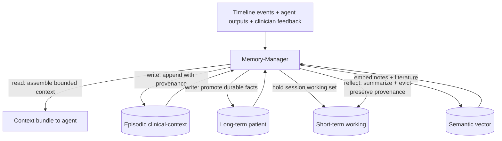
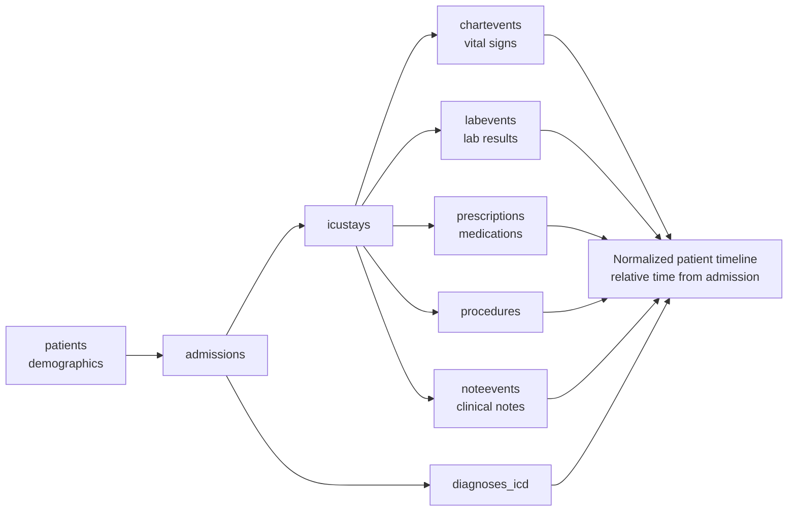
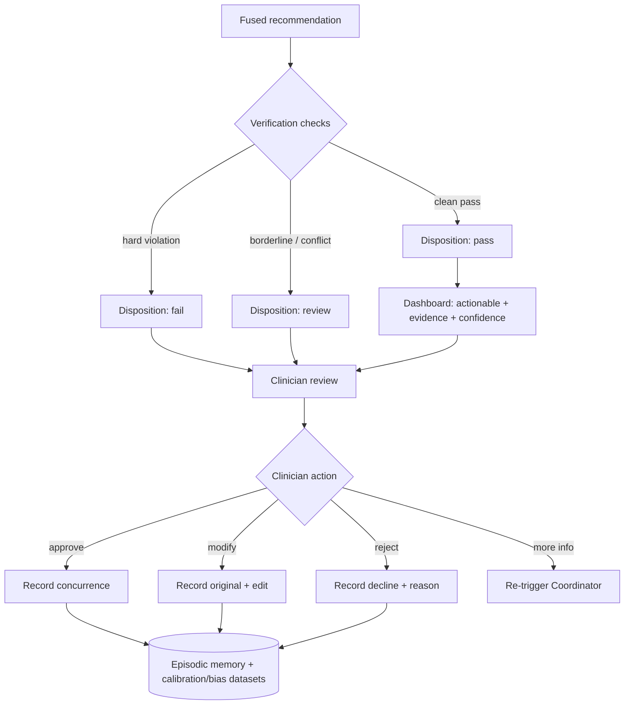
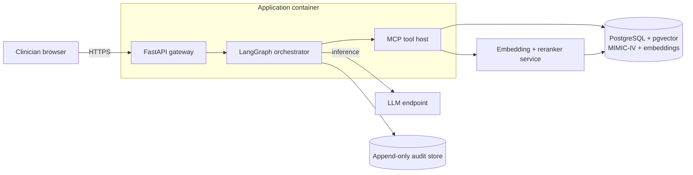
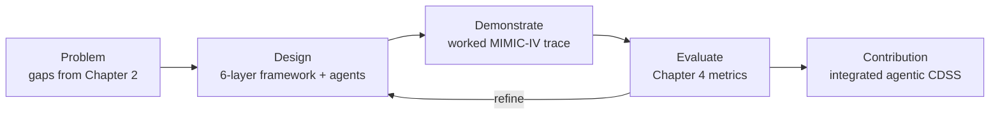

# Diagram Specifications

Renderable Mermaid source for the figures referenced in Chapter 3 and the system-design documents. Each block is self-contained; a one-line caption follows each.

## 1. System Architecture (Figure 3.1)

*Figure 3.1: The six horizontal layers with the cross-cutting Trustworthy AI layer, grounded in MIMIC-IV.*

## 2. Agent Collaboration Sequence (one patient case)

*Agent collaboration for a deteriorating ICU case: parallel Diagnosis and Risk, treatment fusion, faithful explanation, and Verification-driven escalation to the clinician.*

## 3. RAG Pipeline

*RAG pipeline with dual grounding over patient record and external evidence, a rerank stage, and a Self-RAG-style support check that re-queries or abstains on weak evidence.*

## 4. Memory Architecture

*Four memory stores governed by a Memory-Manager applying read, write, and reflect policies under a fixed token budget.*

## 5. Patient Journey Timeline (MIMIC-IV tables)

*Patient journey assembled from core MIMIC-IV tables into a single relative-time timeline consumed by the Data Layer.*

## 6. HITL / Verification Flowchart

*Verification sets a disposition that gates presentation; every clinician action is captured as provenance-tagged feedback feeding memory and the trustworthy-AI datasets.*

## 7. Deployment Diagram

*Server-side deployment: one application container hosts orchestration and MCP tools over a model-serving tier and a PostgreSQL/pgvector data tier with an append-only audit store.*

## 8. Methodology Flowchart (design-science)

*Design-science research cycle: problem to design to demonstration to evaluation, with refinement feeding back into design.*
