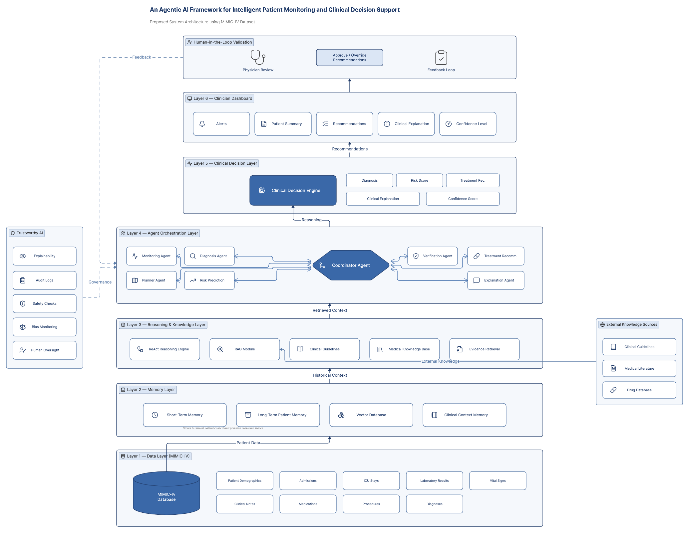

# Proposed Framework

## Title

**An Agentic AI Framework for Intelligent Patient Monitoring and Clinical Decision Support**

---

# 1. Introduction

This research proposes an **Agentic AI Framework** for intelligent patient monitoring and clinical decision support. The framework integrates Large Language Model (LLM)-based autonomous agents, Retrieval-Augmented Generation (RAG), clinical reasoning, persistent memory, and human-in-the-loop validation to assist clinicians in making evidence-based decisions.

Unlike traditional Clinical Decision Support Systems (CDSS), the proposed architecture is designed to support autonomous reasoning, multi-agent collaboration, contextual memory, and explainable recommendations while ensuring physician oversight.

The framework uses the **MIMIC-IV** critical care database as the primary data source for experimentation and evaluation.

---

# 2. Design Objectives

The proposed framework aims to:

- Continuously monitor patient health status.
- Analyze structured and unstructured clinical data.
- Retrieve relevant medical evidence.
- Generate explainable clinical recommendations.
- Predict patient risks.
- Coordinate multiple intelligent agents.
- Maintain long-term patient context.
- Support clinicians through Human-in-the-Loop validation.
- Improve transparency and trustworthiness in AI-assisted healthcare.

---

# 3. Overall Architecture

The framework consists of six primary layers:

1. Data Layer
2. Memory Layer
3. Reasoning & Knowledge Layer
4. Agent Orchestration Layer
5. Clinical Decision Layer
6. Clinician Dashboard

Each layer is responsible for a specific stage of intelligent decision making.

---

# 4. Data Layer

The Data Layer provides clinical information required by the intelligent agents.

The framework uses the **MIMIC-IV** dataset, which contains de-identified electronic health records collected from intensive care units.

The data sources include:

- Patient Demographics
- Hospital Admissions
- ICU Stays
- Laboratory Results
- Vital Signs
- Clinical Notes
- Medications
- Procedures
- Diagnoses

This layer represents the primary source of patient information used for monitoring, reasoning, and decision support.

---

# 5. Memory Layer

The Memory Layer enables the framework to retain patient history and previous reasoning outcomes.

It contains four components:

### Short-Term Memory

Maintains information relevant to the current reasoning session.

Examples:

- Current laboratory values
- Recent vital signs
- Active medications

---

### Long-Term Patient Memory

Stores historical clinical information such as:

- Previous admissions
- Chronic diseases
- Past diagnoses
- Treatment history

---

### Vector Database

Stores semantic embeddings of:

- Clinical notes
- Discharge summaries
- Medical literature
- Retrieved evidence

This enables efficient similarity search during Retrieval-Augmented Generation (RAG).

---

### Clinical Context Memory

Maintains contextual information including:

- Previous agent outputs
- Historical recommendations
- Clinical reasoning traces
- Conversation history

---

# 6. Reasoning & Knowledge Layer

This layer provides intelligent reasoning capabilities.

It consists of:

## ReAct Reasoning Engine

Implements the Reasoning + Acting paradigm by iteratively:

- reasoning,
- retrieving evidence,
- evaluating findings,
- updating decisions.

---

## Retrieval-Augmented Generation (RAG)

Retrieves relevant medical information before generating recommendations.

The retrieval sources include:

- Clinical Guidelines
- Medical Literature
- Drug Databases
- Patient History

RAG reduces hallucinations and improves factual accuracy.

---

## Clinical Practice Guidelines

Provides standardized evidence-based recommendations.

Examples include:

- Sepsis Guidelines
- Hypertension Guidelines
- Diabetes Management
- ICU Protocols

---

## Medical Knowledge Base

Contains curated medical knowledge including:

- diseases
- symptoms
- medications
- procedures
- laboratory interpretations

---

## Evidence Retrieval

Retrieves supporting evidence from external knowledge sources before recommendations are generated.

---

# 7. Agent Orchestration Layer

This is the core intelligence layer of the framework.

A **Coordinator Agent** manages collaboration among specialized AI agents.

The coordinator delegates tasks based on patient conditions.

The framework includes the following agents:

---

## Monitoring Agent

Responsibilities:

- Monitor incoming patient data
- Detect abnormal vital signs
- Identify significant changes

---

## Planner Agent

Creates reasoning plans.

Responsibilities include:

- selecting required agents
- decomposing clinical tasks
- sequencing workflow

---

## Diagnosis Agent

Analyzes symptoms, laboratory findings, and clinical notes to infer potential diagnoses.

---

## Risk Prediction Agent

Predicts clinical deterioration such as:

- mortality risk
- ICU transfer
- sepsis
- readmission

---

## Treatment Recommendation Agent

Suggests evidence-based interventions including:

- medications
- laboratory tests
- procedures
- follow-up actions

---

## Explanation Agent

Generates transparent explanations describing:

- why recommendations were made
- supporting evidence
- confidence level

---

## Verification Agent

Performs safety validation by checking:

- guideline compliance
- conflicting recommendations
- confidence thresholds
- evidence consistency

---

# 8. Clinical Decision Layer

Outputs from all agents are integrated into the Clinical Decision Engine.

The engine produces:

- Diagnosis
- Risk Score
- Treatment Recommendation
- Clinical Explanation
- Confidence Score

Recommendations are generated only after successful verification.

---

# 9. Clinician Dashboard

The dashboard provides clinicians with an interactive interface displaying:

- Patient Summary
- Alerts
- Risk Scores
- Diagnoses
- Treatment Recommendations
- Clinical Explanation
- Confidence Level

The dashboard supports clinician review rather than autonomous decision making.

---

# 10. Human-in-the-Loop Validation

The proposed framework keeps physicians in control.

Clinicians can:

- approve recommendations
- reject recommendations
- modify recommendations
- provide feedback

This feedback can be incorporated into future reasoning and system improvement.

---

# 11. External Knowledge Sources

The framework integrates external medical resources through the RAG module.

These include:

- Clinical Practice Guidelines
- Medical Literature
- Drug Databases

External knowledge enhances evidence retrieval and keeps recommendations aligned with current medical practices.

---

# 12. Trustworthy AI Layer

To ensure safe deployment in healthcare, the framework incorporates Trustworthy AI principles.

The framework includes:

- Explainability
- Audit Logs
- Safety Checks
- Bias Monitoring
- Human Oversight

These mechanisms improve transparency, accountability, and clinician trust.

---

# 13. System Workflow

The proposed workflow proceeds as follows:

1. Patient data are extracted from the MIMIC-IV dataset.
2. Relevant patient history is retrieved from the Memory Layer.
3. The RAG module retrieves supporting medical evidence.
4. The ReAct Reasoning Engine performs iterative reasoning.
5. The Coordinator Agent assigns tasks to specialized agents.
6. Each agent produces intermediate outputs.
7. The Verification Agent validates recommendations.
8. The Clinical Decision Engine combines all validated outputs.
9. Recommendations are presented to clinicians.
10. Clinicians review, approve, or modify recommendations.
11. Feedback is stored for future reasoning.

---

# 14. Expected Contributions

The proposed framework contributes to intelligent healthcare by:

- Integrating Agentic AI into clinical decision support.
- Combining multi-agent collaboration with ReAct reasoning.
- Using Retrieval-Augmented Generation to reduce hallucinations.
- Maintaining persistent patient memory for longitudinal care.
- Supporting explainable AI through transparent reasoning.
- Enabling Human-in-the-Loop clinical validation.
- Leveraging the MIMIC-IV dataset for reproducible evaluation.

---

# 15. Figure

**Figure 4.1:** Proposed Agentic AI Framework for Intelligent Patient Monitoring and Clinical Decision Support using the MIMIC-IV Dataset.

