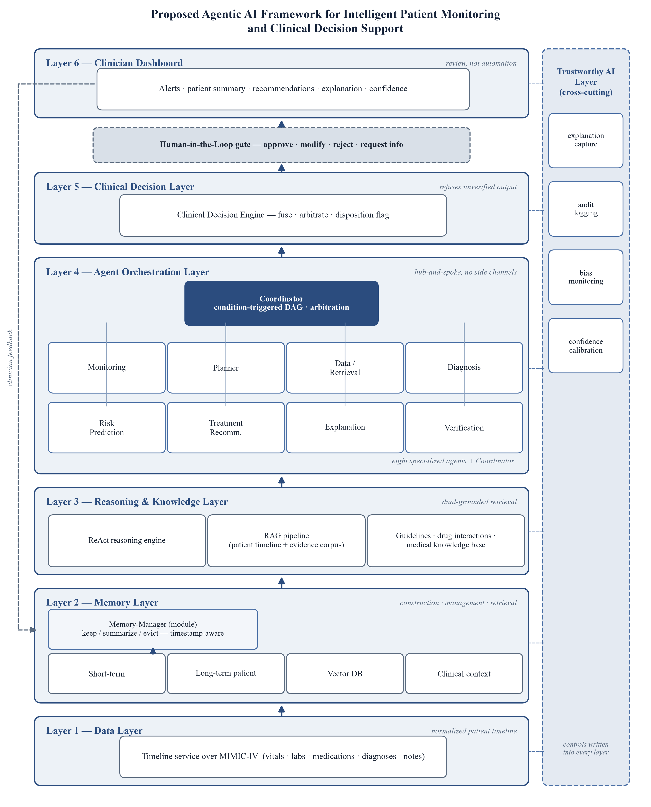

# Proposed Framework

## Title

**An Agentic AI Framework for Intelligent Patient Monitoring and Clinical Decision Support**

> **Canonical status.** The examiner-grade treatment of this architecture is
> `07_Thesis/Chapter_3/Chapter_3.md`; this document is the working summary and must stay
> consistent with it (eight specialized agents + Coordinator + Memory-Manager module; six
> layers + cross-cutting Trustworthy AI + HITL gating). Updated to the canonical scheme
> 2026-08-13.

---

# 1. Introduction

This research proposes an **Agentic AI Framework** for intelligent patient monitoring and clinical decision support. The framework integrates Large Language Model (LLM)-based autonomous agents, Retrieval-Augmented Generation (RAG), clinical reasoning, persistent memory, and human-in-the-loop validation to assist clinicians in making evidence-based decisions.

Unlike traditional Clinical Decision Support Systems (CDSS), the proposed architecture is designed to support autonomous reasoning, multi-agent collaboration, contextual memory, and explainable recommendations while ensuring physician oversight.

The framework uses the **MIMIC-IV** critical care database as the primary data source for experimentation and evaluation.

---

# 2. Design Objectives

The proposed framework aims to:

- Continuously monitor patient health status.
- Analyze structured and unstructured clinical data.
- Retrieve relevant medical evidence.
- Generate explainable clinical recommendations.
- Predict patient risks.
- Coordinate multiple intelligent agents.
- Maintain long-term patient context.
- Support clinicians through Human-in-the-Loop validation.
- Improve transparency and trustworthiness in AI-assisted healthcare.

---

# 3. Overall Architecture

The framework consists of six primary layers:

1. Data Layer
2. Memory Layer
3. Reasoning & Knowledge Layer
4. Agent Orchestration Layer
5. Clinical Decision Layer
6. Clinician Dashboard

Each layer is responsible for a specific stage of intelligent decision making. Two elements cut across this stack rather than sitting inside it: the Trustworthy AI layer (Section 12), whose controls every layer writes into, and the human-in-the-loop validation gate (Section 10), which sits between the Clinical Decision Layer and the Clinician Dashboard.

---

# 4. Data Layer

The Data Layer provides clinical information required by the intelligent agents.

The framework uses the **MIMIC-IV** dataset, which contains de-identified electronic health records collected from intensive care units [johnson2023mimic].

The data sources include:

- Patient Demographics
- Hospital Admissions
- ICU Stays
- Laboratory Results
- Vital Signs
- Clinical Notes
- Medications
- Procedures
- Diagnoses

This layer represents the primary source of patient information used for monitoring, reasoning, and decision support.

---

# 5. Memory Layer

The Memory Layer enables the framework to retain patient history and previous reasoning outcomes.

It contains four memory stores, governed by an explicit Memory-Manager module:

### Short-Term Memory

Maintains information relevant to the current reasoning session.

Examples:

- Current laboratory values
- Recent vital signs
- Active medications

---

### Long-Term Patient Memory

Stores historical clinical information such as:

- Previous admissions
- Chronic diseases
- Past diagnoses
- Treatment history

---

### Vector Database

Stores semantic embeddings of:

- Clinical notes
- Discharge summaries
- Medical literature
- Retrieved evidence

This enables efficient similarity search during Retrieval-Augmented Generation (RAG).

---

### Clinical Context Memory

Maintains contextual information including:

- Previous agent outputs
- Historical recommendations
- Clinical reasoning traces
- Conversation history

---

### Memory-Manager (module)

A deterministic policy module — not an agent — that governs the four stores: it decides what is kept verbatim, what is summarized, and what is evicted, and it enforces timestamp-aware retrieval so that no future data can enter a decision. Its operation vocabulary (construction / management / retrieval) follows the memory survey and is detailed in Section 16.2 [wu2025memory].

---

# 6. Reasoning & Knowledge Layer

This layer provides intelligent reasoning capabilities.

It consists of:

## ReAct Reasoning Engine

Implements the Reasoning + Acting paradigm [yao2023react] by iteratively:

- reasoning,
- retrieving evidence,
- evaluating findings,
- updating decisions.

---

## Retrieval-Augmented Generation (RAG)

Retrieves relevant medical information before generating recommendations.

The retrieval sources include:

- Clinical Guidelines
- Medical Literature
- Drug Databases
- Patient History

Grounding generation in retrieved evidence reduces hallucinated content and improves factual accuracy, which is why retrieval precedes every recommendation in this framework [lewis2020rag; gao2023rag].

---

## Clinical Practice Guidelines

Provides standardized evidence-based recommendations.

Examples include:

- Sepsis Guidelines
- Hypertension Guidelines
- Diabetes Management
- ICU Protocols

---

## Medical Knowledge Base

Contains curated medical knowledge including:

- diseases
- symptoms
- medications
- procedures
- laboratory interpretations

---

## Evidence Retrieval

Retrieves supporting evidence from external knowledge sources before recommendations are generated.

---

# 7. Agent Orchestration Layer

This is the core intelligence layer of the framework.

A **Coordinator Agent** manages collaboration among specialized AI agents.

The coordinator delegates tasks based on patient conditions.

The framework includes the following eight specialized agents:

---

## Monitoring Agent

Responsibilities:

- Monitor incoming patient data
- Detect abnormal vital signs
- Identify significant changes

---

## Planner Agent

Creates reasoning plans.

Responsibilities include:

- selecting required agents
- decomposing clinical tasks
- sequencing workflow

---

## Data/Retrieval Agent

Owns every read from the Data Layer and the RAG pipeline on behalf of the other agents.

Responsibilities:

- executing retrieval requests for the reasoning agents
- attaching provenance to each retrieved item
- enforcing timestamp-aware access so no future data enters a decision

Centralizing retrieval in one agent is what makes evidence provenance auditable end-to-end.

---

## Diagnosis Agent

Analyzes symptoms, laboratory findings, and clinical notes to infer potential diagnoses.

---

## Risk Prediction Agent

Predicts clinical deterioration such as:

- mortality risk
- ICU transfer
- sepsis
- readmission

---

## Treatment Recommendation Agent

Suggests evidence-based interventions including:

- medications
- laboratory tests
- procedures
- follow-up actions

---

## Explanation Agent

Generates transparent explanations describing:

- why recommendations were made
- supporting evidence
- confidence level

---

## Verification Agent

Performs safety validation by checking:

- guideline compliance
- conflicting recommendations
- confidence thresholds
- evidence consistency

---

# 8. Clinical Decision Layer

Outputs from all agents are integrated into the Clinical Decision Engine.

The engine produces:

- Diagnosis
- Risk Score
- Treatment Recommendation
- Clinical Explanation
- Confidence Score

Recommendations are generated only after successful verification.

---

# 9. Clinician Dashboard

The dashboard provides clinicians with an interactive interface displaying:

- Patient Summary
- Alerts
- Risk Scores
- Diagnoses
- Treatment Recommendations
- Clinical Explanation
- Confidence Level

The dashboard supports clinician review rather than autonomous decision making.

---

# 10. Human-in-the-Loop Validation

The proposed framework keeps physicians in control.

Clinicians can:

- approve recommendations
- reject recommendations
- modify recommendations
- provide feedback

This feedback can be incorporated into future reasoning and system improvement.

---

# 11. External Knowledge Sources

The framework integrates external medical resources through the RAG module.

These include:

- Clinical Practice Guidelines
- Medical Literature
- Drug Databases

External knowledge enhances evidence retrieval and keeps recommendations aligned with current medical practices.

---

# 12. Trustworthy AI Layer (cross-cutting)

The Trustworthy AI layer is not a seventh pipeline stage; it is a set of controls that every layer writes into — the framing Chapter 3, Section 3.3.7 makes explicit:

- explanations are captured at the reasoning step that produced them;
- audit records are written by every agent as it acts;
- bias is measured on the data as it is partitioned;
- confidence is calibrated at the point of emission;
- human oversight is enforced at the HITL gate (Section 10).

Enforcing each control where its concern arises, rather than bolting checks onto the end of the pipeline, avoids post-hoc rationalization — explanations produced after the fact that do not reflect the reasoning that generated the recommendation [rasheed2022explainable].

---

# 13. System Workflow

The proposed workflow proceeds as follows:

1. Patient data are extracted from the MIMIC-IV dataset.
2. Relevant patient history is retrieved from the Memory Layer.
3. The RAG module retrieves supporting medical evidence.
4. The ReAct Reasoning Engine performs iterative reasoning.
5. The Coordinator Agent assigns tasks to specialized agents.
6. Each agent produces intermediate outputs.
7. The Verification Agent validates recommendations.
8. The Clinical Decision Engine combines all validated outputs.
9. Recommendations are presented to clinicians.
10. Clinicians review, approve, or modify recommendations.
11. Feedback is stored for future reasoning.

---

# 14. Expected Contributions

The proposed framework contributes to intelligent healthcare by:

- Integrating Agentic AI into clinical decision support.
- Combining multi-agent collaboration with ReAct reasoning.
- Using Retrieval-Augmented Generation to reduce hallucinations.
- Maintaining persistent patient memory for longitudinal care.
- Supporting explainable AI through transparent reasoning.
- Enabling Human-in-the-Loop clinical validation.
- Leveraging the MIMIC-IV dataset for reproducible evaluation.

---

# 15. Figure

*Figure 3.1.* Proposed Agentic AI framework for intelligent patient monitoring and clinical decision support using the MIMIC-IV dataset.

> **Figure regenerated 2026-08-14** to the canonical scheme (eight specialized agents +
> Coordinator, Memory-Manager module, HITL gate, cross-cutting Trustworthy AI layer), per
> `Diagrams/Diagram_Specs.md` spec 1: vector source `Diagrams/framework_figure_3_1.svg`,
> 300-dpi export `Diagrams/framework_figure_3_1.png` (also deployed to
> `07_Thesis/Images/proposed_framework.png`). The superseded 2026-07-22 seven-agent export
> (`image.png`) is retained only as drafting history — do not embed it anywhere.

---

# 16. Refinements from the 2025-2026 Literature Update

The August 2026 review of P021-P045 confirms the core idea of the framework and motivates five
bounded refinements. None changes the layered architecture or the thesis claim; each hardens a
layer against a failure mode the newest literature has now documented.

## 16.1 Standardized Tool and Agent Interfaces

The Data Layer and Agent Orchestration Layer should expose tools through the Model Context
Protocol (MCP) and reserve an Agent-to-Agent (A2A) style channel for inter-agent messages, rather
than bespoke APIs. Interoperability protocols have consolidated quickly [ehtesham2025protocols],
and adopting them keeps the prototype composable with hospital-side tooling. This is an interface
decision only; agent responsibilities are unchanged.

## 16.2 Memory Layer Terminology and Operations

The Memory Layer keeps its four stores (short-term, long-term patient memory, vector database,
clinical context memory) but adopts the construction / management / retrieval operation taxonomy
from the memory survey [wu2025memory]. Concretely: memory writes are explicit construction events
linked to source evidence; management includes decay and conflict-resolution rules for revised
lab values; retrieval is always timestamp-aware. This sharpens the framework's central novelty -
the patient timeline as a first-class retrieval corpus - in the vocabulary the field now uses.

## 16.3 Verification Agent: Hallucination and Uncertainty Checks

The Verification Agent gains two concrete check types drawn from the new safety literature:
(a) recommendation-level grounding checks against the medical hallucination taxonomy
[kim2025hallucinations], and (b) a calibrated confidence estimate attached to every
recommendation, following the uncertainty-quantification argument that a clinical system must
communicate how sure it is [atf2025uncertainty]. Both checks write their outcomes to the audit
trail so that verification quality is itself measurable.

## 16.4 Orchestration Topology Hardening

MedSentry shows that multi-agent topology materially affects how far a compromised or erroneous
agent can propagate influence [chen2025medsentry]. The Coordinator Agent therefore enforces a
hub-and-spoke message topology (no direct agent-to-agent side channels), applies input screening
on retrieved external content, and can quarantine an agent whose outputs repeatedly fail
verification. TrustAgent's intrinsic/extrinsic threat split [yu2025trustagent] is used as the
checklist for the security review in Chapter 4.

## 16.5 Evaluation and Regulatory Alignment

The Chapter 4 evaluation adds comparators that did not exist at proposal time: MedAgentBench-style
task success in a FHIR-shaped environment [jiang2025medagentbench], HealthBench-style rubric
grading of recommendation quality [arora2025healthbench], and the revisited MIMIC-IV prediction
baselines [lovon2025mimic]. The Trustworthy AI Layer documents how the framework's guardrails,
human oversight, and audit trail map onto the safeguards prescribed for "unconfined
non-deterministic clinical software" [tan2026undcs], acknowledging that LLM-based decision support
can constitute regulated medical-device output [weissman2025unregulated]. The human-in-the-loop
design cites the collaboration meta-analysis as motivation for structured rather than free-form
clinician review [wang2026collaboration].
