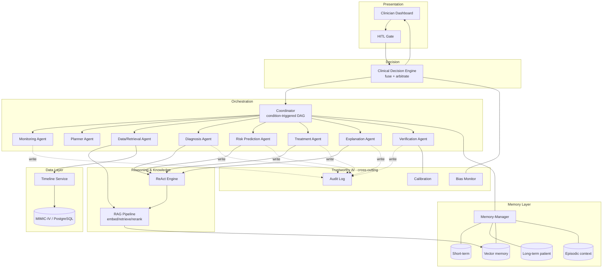
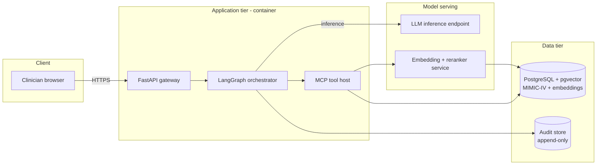

# System Design

This document is the engineering companion to the framework specified in Chapter 3. It fixes the concrete component structure, deployment topology, inter-agent message contract, technology stack, and non-functional requirements for the bounded prototype. Chapter 3 defines *what* the framework does and *why*; this document defines *how* it is built.

## 1. Component View


*Component view: orchestration agents sit over a shared reasoning/knowledge tier and a memory tier, all reading from a MIMIC-IV data substrate, with the Trustworthy AI concerns wired in cross-cutting.*

## 2. Deployment View


*Deployment view: a single application container hosts the orchestrator and MCP tool host, backed by a model-serving tier and a PostgreSQL/pgvector data tier plus an append-only audit store; all traffic is server-side so patient data never reaches the browser except as rendered results.*

## 3. Agent Message Schema

All inter-agent traffic uses one envelope so the Coordinator, agents, and audit log share a single contract. Payload shapes follow the per-agent output schemas in Chapter 3, Section 3.4.

```json
{
  "message_id": "uuid-v4",
  "case_id": "case-2026-000123",
  "trace_id": "dag-run-0007",
  "sender": "diagnosis_agent",
  "recipient": "coordinator",
  "timestamp_rel": "P0DT36H",
  "type": "agent_result",
  "depends_on": ["data_retrieval_agent"],
  "payload": {
    "primary_dx": "sepsis (source unconfirmed)",
    "differentials": [
      { "dx": "sepsis", "likelihood": 0.62, "evidence_refs": ["chartevents:HR", "labevents:lactate", "guideline:sepsis-3"] },
      { "dx": "non-infectious SIRS", "likelihood": 0.24, "evidence_refs": ["labevents:wbc"] }
    ],
    "flags": ["insufficient_evidence:source"]
  },
  "evidence_refs": ["chartevents:220045", "labevents:50813"],
  "confidence_raw": 0.66,
  "model_version": "llm@2026-06",
  "audit": { "tools_called": ["timeline.fetch", "rag.retrieve"], "latency_ms": 5120 }
}
```

The envelope carries provenance (`evidence_refs`), causality (`depends_on`, `trace_id`), and audit fields (`model_version`, `audit`) on every hop, so a full case is replayable from the message log alone.

## 4. Technology Stack

| Concern | Choice | Justification |
|---|---|---|
| Orchestration | **LangGraph** | Agent workflows here are a stateful DAG with conditional edges, parallel branches, and cycles (ReAct). LangGraph models graphs with shared state and checkpointing directly, unlike linear chain frameworks; the condition-triggered routing of Section 3.4 maps onto its conditional edges. |
| Tool exposure | **MCP (Model Context Protocol)** | Retrieval, timeline access, and the drug-interaction checker are exposed as MCP tools so agents call them through one typed interface, decoupling tool implementation from agent prompts and keeping tool calls auditable. |
| LLM serving | Hosted inference endpoint (prototype); self-hosted open-weight serving as scale-out option | A hosted endpoint removes GPU operations for the bounded prototype; self-hosting is named for cost control and data-residency at scale. Provider left generic — the framework depends on the interface, not one vendor. |
| Vector store | **pgvector** (prototype) → **Qdrant** (scale-out) | pgvector co-locates embeddings with MIMIC-IV relational data in one PostgreSQL instance, simplifying provenance joins and eliminating a second service. Qdrant is the migration target for payload filtering and horizontal scale (see `Technical_Feasibility.md`). |
| Embeddings / rerank | Biomedical bi-encoder + cross-encoder reranker | Domain-tuned embeddings retrieve clinical text more precisely than general models; the cross-encoder rerank stage removes irrelevant passages before they reach the prompt. |
| Relational data | **PostgreSQL** | MIMIC-IV ships as relational tables; PostgreSQL hosts both the records and, via pgvector, the embeddings. |
| API / gateway | **FastAPI** | Async request handling suits the long-running, I/O-bound agent calls; server-side only, so patient data stays in the app tier. |
| Audit store | Append-only, hash-chained log | Immutability and replay are governance requirements (Chapter 3, Section 3.8). |

## 5. Non-Functional Requirements

**Latency budget.** The target is a full seven-agent case within a clinically tolerable window; the risk that this is not met is analyzed in `Technical_Feasibility.md`. Indicative per-stage budgets for the full DAG:

| Stage | Budget (s) | Note |
|---|---|---|
| Monitoring | ≤ 1 | rule-based, no LLM |
| Planner | ≤ 4 | single LLM call |
| Data/Retrieval | ≤ 3 | retrieve + rerank |
| Diagnosis / Risk (parallel) | ≤ 8 | ReAct, run concurrently |
| Treatment | ≤ 6 | includes interaction check |
| Explanation | ≤ 5 | trace assembly |
| Verification | ≤ 4 | checks + calibration |
| **End-to-end (parallelized)** | **≤ 30** | stable-path cases far lower via short-circuit routing |

The 30-second target is aggressive given that MedAgents reports ~40s per question with fewer agents [tang2024medagents]; parallelizing independent branches and short-circuiting stable cases are the levers that make it plausible, and both are design commitments in Section 3.4.

**Cost per case.** Cost is dominated by LLM tokens. The Coordinator's short-circuit routing keeps stable cases to two LLM calls, while full-DAG cases incur roughly seven-to-ten calls plus retrieval. Token budgeting via the Memory-Manager's retrieval windowing (Section 3.5) caps per-call context and therefore per-case cost; an explicit ceiling is set during evaluation.

**Scalability.** Cases are independent, so the application tier scales horizontally behind the gateway. The bottleneck is the model-serving tier; batching and, at scale, self-hosted serving address throughput. The vector store migrates from pgvector to Qdrant when concurrent full-corpus retrieval saturates in-database search.

**Privacy.** MIMIC-IV is de-identified, but the design treats data as sensitive regardless: all processing is server-side, patient data reaches the browser only as rendered recommendations, embeddings and records stay in one controlled PostgreSQL instance, and the audit log records every access. Timestamps are handled in relative time only, consistent with the dataset's de-identification [johnson2023mimic].
