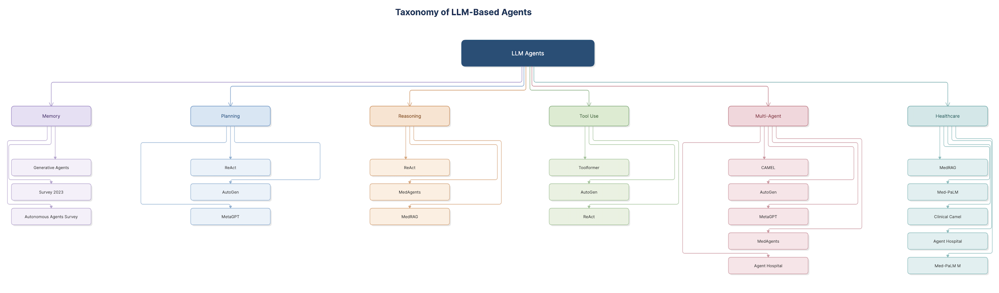

# Taxonomy of Large Language Model (LLM)-Based Agents

---

## Figure Title

**Figure 2.X:** Taxonomy of Large Language Model (LLM)-Based Agents

---

# 1. Introduction

Large Language Model (LLM)-based agents have evolved rapidly from simple prompt-based systems into intelligent autonomous agents capable of reasoning, planning, memory management, tool utilization, collaboration, and domain-specific decision making. Numerous architectures have been proposed in recent years, each focusing on different capabilities required for building autonomous AI systems.

To better understand the research landscape, this study categorizes the reviewed literature into six major capability-based dimensions:

- Memory
- Planning
- Reasoning
- Tool Use
- Multi-Agent Systems
- Healthcare Applications

The taxonomy provides a structured overview of existing research and identifies the key technologies that influence the design of the proposed Agentic AI framework for intelligent patient monitoring and clinical decision support.

---

# 2. Purpose of the Taxonomy

The objective of this taxonomy is to:

- Organize the reviewed literature according to major Agentic AI capabilities.
- Highlight the evolution of LLM-based autonomous agents.
- Identify relationships among different research areas.
- Reveal research trends relevant to healthcare.
- Provide the theoretical foundation for the proposed framework.

Rather than classifying papers solely by publication year or application domain, this taxonomy groups studies according to their primary architectural contributions.

---

# 3. Taxonomy Categories

The proposed taxonomy consists of six capability-based categories.

---

## 3.1 Memory

Memory enables LLM agents to retain, retrieve, and utilize previous information to support long-term reasoning and contextual decision making.

Memory mechanisms improve:

- long-term context retention
- patient history management
- personalized recommendations
- continuous learning

The following studies contribute primarily to memory architectures:

| Paper | Contribution |
|--------|--------------|
| Generative Agents | Memory stream, reflection, and retrieval mechanisms for persistent contextual reasoning. |
| The Rise and Potential of LLM-Based Agents: A Survey | Comprehensive taxonomy of short-term, episodic, semantic, and vector memory. |
| A Survey on Large Language Model Based Autonomous Agents | Reviews hybrid memory architectures, memory reading, writing, and reflection strategies. |

Memory is particularly important in healthcare because patient care depends on historical clinical information, previous diagnoses, medications, laboratory trends, and longitudinal observations.

---

## 3.2 Planning

Planning enables autonomous agents to decompose complex objectives into smaller executable tasks.

Planning capabilities include:

- goal decomposition
- workflow generation
- task scheduling
- iterative refinement
- execution monitoring

Representative planning architectures include:

| Paper | Contribution |
|--------|--------------|
| ReAct | Dynamic reasoning and action planning through iterative interaction. |
| AutoGen | Conversation programming for collaborative task planning. |
| MetaGPT | Standard Operating Procedure (SOP)-driven planning among specialized agents. |

Planning is essential in clinical decision support because diagnosis and treatment involve sequential reasoning rather than isolated predictions.

---

## 3.3 Reasoning

Reasoning enables agents to analyze information, infer conclusions, evaluate evidence, and justify recommendations.

Major reasoning techniques include:

- Chain-of-Thought (CoT)
- ReAct
- Reflection
- Evidence-based reasoning
- Knowledge Graph reasoning

Key papers include:

| Paper | Contribution |
|--------|--------------|
| ReAct | Combines reasoning with external actions. |
| MedAgents | Collaborative medical reasoning among specialized expert agents. |
| MedRAG | Knowledge graph-guided clinical reasoning with Retrieval-Augmented Generation. |

Reasoning forms the core intelligence of autonomous healthcare systems by transforming patient data into clinically meaningful decisions.

---

## 3.4 Tool Use

Modern LLM agents extend their capabilities by interacting with external software tools, APIs, and databases.

Common tools include:

- web search
- calculators
- databases
- Python execution
- vector databases
- medical knowledge repositories

Representative studies include:

| Paper | Contribution |
|--------|--------------|
| Toolformer | Self-supervised learning of API usage. |
| AutoGen | Multi-tool execution using conversational agents. |
| ReAct | Dynamic interaction with external knowledge sources. |

Tool utilization significantly reduces hallucinations by grounding responses in external information.

---

## 3.5 Multi-Agent Systems

Multi-agent systems consist of multiple specialized autonomous agents working collaboratively to solve complex tasks.

Typical agent roles include:

- coordinator
- planner
- diagnosis agent
- reviewer
- verifier
- executor

Important multi-agent frameworks include:

| Paper | Contribution |
|--------|--------------|
| CAMEL | Role-playing collaborative agents using inception prompting. |
| AutoGen | Flexible multi-agent conversation framework. |
| MetaGPT | SOP-driven software engineering agents. |
| MedAgents | Multi-disciplinary medical consultation among AI experts. |
| Agent Hospital | Collaborative virtual hospital with autonomous medical agents. |

Multi-agent collaboration enables specialization, parallel reasoning, and improved decision quality compared with single-agent architectures.

---

## 3.6 Healthcare Applications

Healthcare represents one of the fastest-growing application domains for LLM-based agents.

Healthcare-specific capabilities include:

- clinical reasoning
- diagnosis
- treatment recommendation
- patient monitoring
- evidence retrieval
- explainable recommendations

Major healthcare studies include:

| Paper | Contribution |
|--------|--------------|
| MedRAG | Retrieval-Augmented Generation using clinical knowledge graphs. |
| Med-PaLM | Safe clinical question answering with medical instruction tuning. |
| Clinical Camel | Open-source medical LLM trained through dialogue-based knowledge encoding. |
| Agent Hospital | Autonomous clinical simulation and medical agent evolution. |
| Med-PaLM M | Multimodal biomedical AI integrating clinical text, images, and genomics. |

These studies collectively demonstrate the feasibility of applying Agentic AI to intelligent healthcare systems.

---

# 4. Relationship Among Categories

Although each category focuses on a distinct capability, modern Agentic AI systems integrate all six dimensions into a unified architecture.

The overall relationship can be summarized as follows:

- Memory provides historical context.
- Planning decomposes complex objectives.
- Reasoning analyzes available evidence.
- Tool Use retrieves external knowledge.
- Multi-Agent collaboration distributes specialized tasks.
- Healthcare applications integrate these capabilities into safe and explainable clinical workflows.

The proposed framework developed in this thesis combines these categories into a comprehensive architecture for intelligent patient monitoring and clinical decision support.

---

# 5. Relevance to the Proposed Framework

The taxonomy directly informed the design of the proposed Agentic AI framework.

Specifically:

- Memory inspired the framework's persistent patient memory layer.
- Planning motivated the Planner Agent and workflow orchestration.
- Reasoning guided the integration of the ReAct reasoning engine.
- Tool Use influenced the incorporation of Retrieval-Augmented Generation (RAG).
- Multi-Agent research motivated the coordinator-based agent architecture.
- Healthcare studies validated the applicability of autonomous agents in clinical environments.

Together, these categories provide the theoretical foundation for the proposed architecture presented in Chapter 3.

---

# 6. Summary

The taxonomy demonstrates that modern LLM-based agents have evolved from isolated language models into collaborative, memory-enabled, reasoning-driven intelligent systems capable of solving complex real-world problems.

Among the reviewed literature, six core capabilities consistently emerge as the fundamental building blocks of Agentic AI:

- Memory
- Planning
- Reasoning
- Tool Use
- Multi-Agent Collaboration
- Healthcare Intelligence

These capabilities collectively shape the proposed framework for intelligent patient monitoring and clinical decision support using the MIMIC-IV dataset.

---

# Figure

**Figure 2.X:** Taxonomy of Large Language Model (LLM)-Based Agents.

