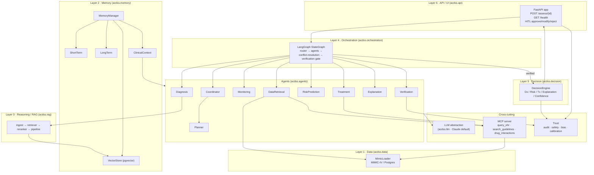
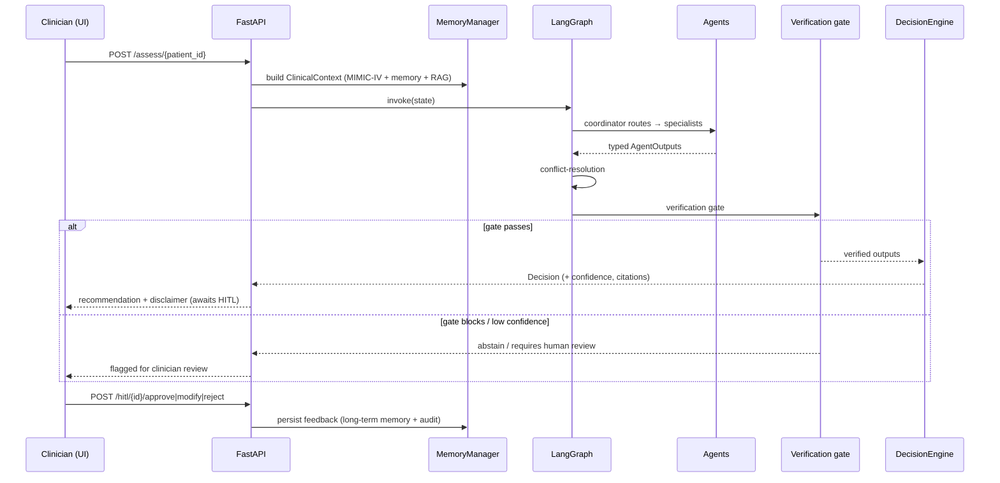

# ACDSS Architecture

How the source modules realize the thesis architecture. See the top-level
[`README.md`](../README.md) for setup and the six-layer overview.

> ⚠️ Research prototype, not a medical device. Decision support only.

---

## Module diagram

---

## Request flow (`POST /assess/{patient_id}`)

---

## Layer → package map

| Layer | Package | Key symbols |
| ----- | ------- | ----------- |
| 1 Data | `acdss.data` | `MimicLoader`, `PatientRecord`, `VitalSign` |
| 2 Memory | `acdss.memory` | `MemoryManager`, `ShortTermMemory`, `LongTermMemory`, `VectorStore`, `ClinicalContext` |
| 3 Reasoning/RAG | `acdss.rag` | `Ingestor`, `Retriever`, `Reranker`, `RagPipeline` |
| 4 Orchestration | `acdss.orchestration` | `build_graph`, `AssessmentState`, `conflict_resolution_node`, `verification_node` |
| 5 Decision | `acdss.decision` | `DecisionEngine`, `Decision` |
| 6 API/UI | `acdss.api` | `app`, `/assess`, `/health`, HITL routes |
| — Agents | `acdss.agents` | `Agent` ABC + 9 agents |
| — LLM | `acdss.llm` | `LLMClient`, `AnthropicClient` |
| — Tools | `acdss.mcp` | `query_ehr`, `search_guidelines`, `drug_interactions` |
| — Trust | `acdss.trust` | `AuditLog`, `SafetyGuard`, `BiasMonitor`, `Calibrator` |

---

## Design notes

- **LLM is swappable.** All agents depend on the `LLMClient` interface, not the
  concrete Anthropic client, so the provider/model can change via config.
- **Typed agent contracts.** `Agent[I, O]` is generic over Pydantic
  `AgentInput`/`AgentOutput` subclasses, giving each agent a validated I/O shape.
- **Verification gate before decision.** The graph cannot reach the
  `DecisionEngine` unless the verification node sets `verified=True`; the engine
  additionally abstains below `MIN_CONFIDENCE`.
- **Human-in-the-loop by default.** `REQUIRE_HITL` forces every recommendation
  through clinician approve/modify/reject before it is considered final.
- **Trust is cross-cutting.** Audit logging, safety rules, bias monitoring, and
  calibration wrap the pipeline rather than living in any single layer.
